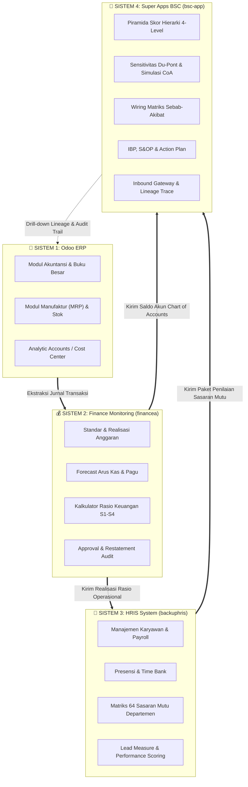
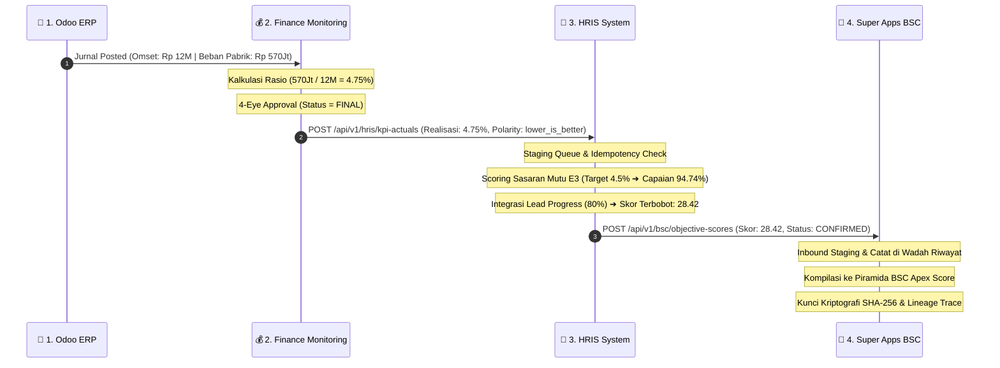

# 🏛️ BUKU PANDUAN LENGKAP ARSITEKTUR SISTEM & OPERASIONAL
# SUPER APPS BALANCED SCORECARD (BSC) & EKOSISTEM MULTI-APLIKASI
**PT Herbatech Innopharma Industry**  
*Versi Dokumen: 2.0 (Edisi Enterprise Komprehensif)*

---

## 📑 DAFTAR ISI UTAMA
1. [BAB I: Gambaran Umum & Filosofi Arsitektur](#bab-i-gambaran-umum--filosofi-arsitektur)
2. [BAB II: Ekosistem Multi-Aplikasi (Topologi 4 Sistem)](#bab-ii-ekosistem-multi-aplikasi-topologi-4-sistem)
3. [BAB III: Struktur Hierarki 4-Level Balanced Scorecard](#bab-iii-struktur-hierarki-4-level-balanced-scorecard)
4. [BAB IV: Panduan Lengkap 12 Menu Modul Super Apps BSC](#bab-iv-panduan-lengkap-12-menu-modul-super-apps-bsc)
   - [Menu 1: Dashboard Piramida Hierarki BSC](#menu-1-dashboard-piramida-hierarki-bsc)
   - [Menu 2: Analisis Rasio Keuangan & Sensitivitas Du-Pont](#menu-2-analisis-rasio-keuangan--sensitivitas-du-pont)
   - [Menu 3: Strategic Objectives & 64 Sasaran Mutu](#menu-3-strategic-objectives--64-sasaran-mutu)
   - [Menu 4: Wiring Diagram & Matriks Sebab-Akibat (Causal Loop)](#menu-4-wiring-diagram--matriks-sebab-akibat-causal-loop)
   - [Menu 5: Simulasi Saldo Akun (CoA) & Stress Testing](#menu-5-simulasi-saldo-akun-coa--stress-testing)
   - [Menu 6: Metode Evaluasi, Skala Nilai & Pembobotan](#menu-6-metode-evaluasi-skala-nilai--pembobotan)
   - [Menu 7: Skenario Peramalan Bisnis (Worst, Base, Best)](#menu-7-skenario-peramalan-bisnis-worst-base-best)
   - [Menu 8: Uji Dampak Perubahan Kebijakan](#menu-8-uji-dampak-perubahan-kebijakan)
   - [Menu 9: Integrated Business Planning (IBP) & S&OP](#menu-9-integrated-business-planning-ibp--sop)
   - [Menu 10: Inisiatif Strategis & Action Plan Tracker](#menu-10-inisiatif-strategis--action-plan-tracker)
   - [Menu 11: Super Admin & Manajemen Pengguna (RBAC)](#menu-11-super-admin--manajemen-pengguna-rbac)
   - [Menu 12: Inbound Gateway, Telemetry 4-Hop & Wadah Riwayat HRIS](#menu-12-inbound-gateway-telemetry-4-hop--wadah-riwayat-hris)
5. [BAB V: Mesin Pipeline Data Otomatis 4-Hop (PRD Flow)](#bab-v-mesin-pipeline-data-otomatis-4-hop-prd-flow)
6. [BAB VI: Formulasi Matematika, Polaritas & Mesin Kalkulasi](#bab-vi-formulasi-matematika-polaritas--mesin-kalkulasi)
7. [BAB VII: Keamanan, Kriptografi & Pencegahan Duplikasi](#bab-vii-keamanan-kriptografi--pencegahan-duplikasi)
8. [BAB VIII: Panduan Instalasi, Deployment & Pemeliharaan Server](#bab-viii-panduan-instalasi-deployment--pemeliharaan-server)

---

## BAB I: Gambaran Umum & Filosofi Arsitektur

**Super Apps Balanced Scorecard (BSC)** adalah platform manajemen kinerja strategis terpadu yang dirancang khusus untuk industri manufaktur farmasi & herbal (**PT Herbatech Innopharma Industry**). 

Sistem ini mentransformasikan visi, misi, dan strategi korporat ke dalam indikator operasional harian yang terukur secara kuantitatif melalui 4 perspektif Kaplan-Norton:
1. **Perspektif Keuangan (*Financial Perspective*)**: Mengukur profitabilitas, likuiditas, solvabilitas, dan efisiensi modal.
2. **Perspektif Pelanggan (*Customer Perspective*)**: Mengukur kepuasan pelanggan, *On-Time In-Full* (OTIF), dan retensi pasar.
3. **Perspektif Proses Bisnis Internal (*Internal Business Process*)**: Mengukur efektivitas operasional pabrik, *Overall Equipment Effectiveness* (OEE), *defect rate*, dan *lead time* produksi.
4. **Perspektif Pembelajaran & Pertumbuhan (*Learning & Growth*)**: Mengukur kompetensi karyawan, produktivitas tenaga kerja, dan budaya inovasi.

---

## BAB II: Ekosistem Multi-Aplikasi (Topologi 4 Sistem)

Super Apps BSC beroperasi sebagai **Pusat Komando Strategis (Apex Hub)** yang terintegrasi secara *real-time* dengan 3 sistem operasional perusahaan:



### Konfigurasi Domain Virtual Host (Laragon Apache):
* **Odoo ERP**: `http://localhost:8069` (Database: `odoo_herbatech`)
* **Finance Monitoring**: `http://financea.test` (Database: `financetrial1`)
* **HRIS System**: `http://backuphris.test` (Database: `hrisv4`)
* **Super Apps BSC**: `http://bsc-app.test` (Database: `bsc_app`)

---

## BAB III: Struktur Hierarki 4-Level Balanced Scorecard

Super Apps BSC menyusun arsitektur pengukuran dalam struktur piramida 4 level hierarki yang saling mengalir (*cascading* & *rolling-up*):

```
┌────────────────────────────────────────────────────────┐
│  LEVEL 1: APEX (Skor Kinerja Korporat / Enterprise)   │
│  Nilai Tunggal Agregat (Skala 0 - 100)                │
└───────────────────────────▲────────────────────────────┘
                            │
┌───────────────────────────┴────────────────────────────┐
│  LEVEL 2: STRATEGIC PERSPECTIVES (4 Pilar Utama)       │
│  Keuangan (40%) · Pelanggan (20%) · Proses (25%) · L&G │
└───────────────────────────▲────────────────────────────┘
                            │
┌───────────────────────────┴────────────────────────────┐
│  LEVEL 3: SASARAN MUTU DEPARTEMEN (64 Indikator)       │
│  OPS, PRO, SC, PRC, RND, QLT, QC, QA, GA, HC, FAT     │
└───────────────────────────▲────────────────────────────┘
                            │
┌───────────────────────────┴────────────────────────────┐
│  LEVEL 4: ACTION PLANS & LEAD MEASURES                 │
│  Inisiatif Strategis, Program Kerja, Pelaksana & Budget│
└────────────────────────────────────────────────────────┘
```

---

## BAB IV: Panduan Lengkap 12 Menu Modul Super Apps BSC

### Menu 1: Dashboard Piramida Hierarki BSC
* **URL**: `http://bsc-app.test/piramida`
* **Fungsi**: Visualisasi piramida interaktif yang menampilkan skor pencapaian dari Level 1 (Apex Korporat), Level 2 (4 Perspektif), Level 3 (Unit Kerja), hingga Level 4 (Indikator Detail).
* **Fitur Utama**:
  - Kartu ringkasan Apex Score dengan kode warna dinamis (Hijau $\ge 90$, Biru $80-89$, Kuning $70-79$, Merah $< 70$).
  - Filter periode (Bulan berjalan, kuartal, tahunan).
  - Mode ekspansi hierarki (*drill-down view*).

### Menu 2: Analisis Rasio Keuangan & Sensitivitas Du-Pont
* **URL**: `http://bsc-app.test/rasio`
* **Fungsi**: Dekomposisi kinerja keuangan menggunakan kerangka kerja Du-Pont 3-Tahap & 5-Tahap.
* **Fitur Utama**:
  - Visualisasi pohon Du-Pont ($ROE = \text{Net Profit Margin} \times \text{Asset Turnover} \times \text{Equity Multiplier}$).
  - Analisis 5 pilar rasio: Likuiditas, Solvabilitas, Aktivitas, Profitabilitas, dan Produktivitas.
  - Grafik tren historis antar periode.

### Menu 3: Strategic Objectives & 64 Sasaran Mutu
* **URL**: `http://bsc-app.test/objective`
* **Fungsi**: Master data dan status evaluasi 64 sasaran mutu yang diturunkan ke 11 departemen/unit kerja.
* **Fitur Utama**:
  - Matriks sasaran mutu per departemen (OPS, PRO, SC, PRC, RND, QLT, QC, QA, GA, HC, FAT).
  - Penanda polaritas (*Higher is Better* vs *Lower is Better*).
  - Status pencapaian: `EXCEEDED`, `ON_TRACK`, `OFF_TRACK`, `CRITICAL`.

### Menu 4: Wiring Diagram & Matriks Sebab-Akibat (Causal Loop)
* **URL**: `http://bsc-app.test/wiring`
* **Fungsi**: Memetakan hubungan korelasi dan ketergantungan (*causal relationship*) antara indikator operasional (*lead*) dengan hasil keuangan (*lag*).
* **Fitur Utama**:
  - Grafik simpul interaktif (*interactive graph node*).
  - Penelusuran dampak domino (*impact cascade tracing*): misal kegagalan OEE mesin pabrik $\rightarrow$ kenaikan biaya per unit $\rightarrow$ penurunan margin laba kotor.

### Menu 5: Simulasi Saldo Akun (CoA) & Stress Testing
* **URL**: `http://bsc-app.test/simulasi-coa`
* **Fungsi**: Laboratorium simulasi keuangan (*what-if scenario*) terhadap akun buku besar.
* **Fitur Utama**:
  - Slider penyesuaian saldo akun (Penjualan, HPP, Beban Pemasaran, Beban Pabrik).
  - Dampak *real-time* instan terhadap seluruh rasio keuangan dan skor Apex BSC.
  - Fitur perbandingan *Baseline* vs *Simulated Result*.

### Menu 6: Metode Evaluasi, Skala Nilai & Pembobotan
* **URL**: `http://bsc-app.test/metode`
* **Fungsi**: Pengaturan konfigurasi algoritma normalisasi skor, skala predikat nilai, dan bobot antar perspektif.
* **Fitur Utama**:
  - Pengaturan formula scoring (Linear Interpolation, Step-based, atau Capped Matrix).
  - Skala Predikat: Istimewa ($A$), Baik ($B$), Cukup ($C$), Kurang ($D$).

### Menu 7: Skenario Peramalan Bisnis (Worst, Base, Best)
* **URL**: `http://bsc-app.test/skenario`
* **Fungsi**: Analisis skenario probabilistik untuk perencanaan masa depan perusahaan.
* **Fitur Utama**:
  - Skenario Optimis (*Best Case*): Pertumbuhan pasar herbal naik $20\%$.
  - Skenario Moderat (*Base Case*): Sesuai target RKAP tahunan.
  - Skenario Pesimis (*Worst Case*): Kenaikan harga bahan baku impor & inflasi energi.

### Menu 8: Uji Dampak Perubahan Kebijakan
* **URL**: `http://bsc-app.test/uji-dampak`
* **Fungsi**: Mengukur sensitivitas dan toleransi sistem terhadap perubahan variabel makro dan mikro.
* **Fitur Utama**:
  - Uji sensitivitas kurs valuta asing, kenaikan UMR regional, dan fluktuasi biaya logistik.
  - Indikator ambang batas aman (*Safe Operating Limit*).

### Menu 9: Integrated Business Planning (IBP) & S&OP
* **URL**: `http://bsc-app.test/ibp`
* **Fungsi**: Penyelarasan rencana penjualan (*Sales Plan*), rencana produksi (*Production Plan*), dan rencana pengadaan (*Procurement Plan*).
* **Fitur Utama**:
  - Rekonsiliasi kapasitas pabrik vs target omset komersial.
  - Evaluasi ketersediaan bahan baku ekstrak herbal & kemasan primer.

### Menu 10: Inisiatif Strategis & Action Plan Tracker
* **URL**: `http://bsc-app.test/action-plan`
* **Fungsi**: Pemantauan eksekusi inisiatif strategis level operasional.
* **Fitur Utama**:
  - Progress bar *Milestone* dan persentase penyelesaian fisik.
  - Realisasi anggaran inisiatif (*CapEx / OpEx*) vs pagu anggaran yang disetujui.
  - Penugasan *PIC* (Person in Charge) dan batas waktu (*deadline*).

### Menu 11: Super Admin & Manajemen Pengguna (RBAC)
* **URL**: `http://bsc-app.test/superadmin`
* **Fungsi**: Manajemen otentikasi, hak akses, dan manajemen pengguna berdasarkan peran (*Role-Based Access Control*).
* **Fitur Utama**:
  - Tingkatan Role: `Superadmin`, `Executive/Direksi`, `Manager Unit`, `Auditor`, `Staff`.
  - Log otentikasi login dan riwayat sesi.

### Menu 12: Inbound Gateway, Telemetry 4-Hop & Wadah Riwayat HRIS
* **URL**: `http://bsc-app.test/admin`
* **Fungsi**: Pusat gerbang penerimaan data terintegrasi dari seluruh aplikasi eksternal.
* **Fitur Utama**:
  1. **Tab `📥 Wadah Riwayat Penerimaan HRIS (Hop 3 ➔ 4)`**:
     - Rekaman lengkap seluruh paket sasaran mutu yang diterima dari HRIS.
     - Multi-filter (Periode, Status Versi Aktif/Superseded).
     - Tombol **`📋 JSON`**: Membuka popup viewer isi paket data payload mentah.
     - Tombol **`🔍 Trace`**: Membuka audit trail pop-up yang melacak alur data dari invoice Odoo ERP hingga kalkulasi skor akhir.
  2. **Tab `4-Hop Pipeline & Rekonsiliasi`**:
     - Diagram interaktif 4-Hop, tombol simulator instan (*Live E2E Pipeline Runner*), dan 4 indikator kontrol rekonsiliasi.
  3. **Tab `Validasi 64 Sasaran Mutu` & `Validasi CoA Finance`**:
     - Tabel komparasi target vs realisasi 64 sasaran mutu dan neraca keuangan masuk.

---

## BAB V: Mesin Pipeline Data Otomatis 4-Hop (PRD Flow)

Rantai proses data otomatis dari transaksi hingga skor puncak berjalan melalui 4 fase (*hop*):



---

## BAB VI: Formulasi Matematika, Polaritas & Mesin Kalkulasi

### 1. Perhitungan Capaian Kinerja Berdasarkan Polaritas

* **Polaritas Positif (*Higher is Better*)**:
  $$\text{Achievement} = \min\left(150\%, \left(\frac{\text{Actual}}{\text{Target}}\right) \times 100\%\right)$$
  *(Digunakan untuk: Omset, OEE Mesin, OTIF Pengiriman, Produktivitas)*

* **Polaritas Negatif (*Lower is Better*)**:
  $$\text{Achievement} = \min\left(150\%, \left(\frac{\text{Target}}{\text{Actual}}\right) \times 100\%\right)$$
  *(Digunakan untuk: Rasio Biaya Operasional, Defect Rate, Turn-over Karyawan, Tingkat Komplain)*

### 2. Perhitungan Skor Sasaran Mutu Terbobot
$$\text{Weighted Score} = \text{Achievement (\%)} \times \text{Weight}$$
*Contoh*: Capaian $94.74\% \times 0.30 = \mathbf{28.42}$

### 3. Agregasi Level Perspektif & Apex
$$\text{Perspective Score} = \sum_{i=1}^{n} (\text{Objective Score}_i \times \text{Objective Weight}_i)$$
$$\text{Apex Enterprise Score} = \sum_{p=1}^{4} (\text{Perspective Score}_p \times \text{Perspective Weight}_p)$$

---

## BAB VII: Keamanan, Kriptografi & Pencegahan Duplikasi

Sistem menerapkan prinsip keamanan berlapis:
1. **Autentikasi Header API Key**: Setiap pemanggilan API antar aplikasi wajib menyertakan header `X-API-KEY`.
2. **Kunci Idempotensi (`Idempotency-Key`)**: Format standar `KPI:PERIODE:DEPT:VERSI` (contoh: `OPS-COST-RATIO:2026-08:DEPT-OPS:v1`).
3. **Fingerprint Kriptografi SHA-256**: Mengunci nilai nominal transaksi asal di Odoo sehingga jika terjadi perubahan tidak sah pada database perantara, sistem BSC akan langsung menolak paket (*integrity mismatch*).
4. **Audit Trail Immutability**: Seluruh aktivitas sinkronisasi dan restatement dicatat secara permanen di tabel `audit_logs` dan tidak dapat dihapus.

---

## BAB VIII: Panduan Instalasi, Deployment & Pemeliharaan Server

### 1. Persyaratan Lingkungan (Environment Requirements)
* **Web Server**: Apache 2.4+ (Laragon / Production Linux Server)
* **PHP**: PHP 8.3+ dengan ekstensi `pdo_mysql`, `curl`, `mbstring`, `openssl`, `json`
* **Node.js**: Node.js v18+ & NPM v9+
* **Database**: MySQL 8.0+ / MariaDB 10.5+

### 2. Langkah Penguncian Konfigurasi (*Config Cache*)
Untuk mencegah terjadinya tumpang tindih variabel lingkungan (*environment collision*) di Apache worker:

```powershell
# 1. Finance Monitoring
cd c:\laragon\www\financea
C:\laragon\bin\php\php-8.3.26-Win32-vs16-x64\php.exe artisan config:cache

# 2. HRIS System
cd c:\laragon\www\backuphris
C:\laragon\bin\php\php-8.3.26-Win32-vs16-x64\php.exe artisan config:cache

# 3. Super Apps BSC
cd c:\laragon\www\bsc-app
C:\laragon\bin\php\php-8.3.26-Win32-vs16-x64\php.exe artisan config:cache
```

### 3. Kompilasi Aset Frontend (Vite)
```powershell
cd c:\laragon\www\bsc-app
npm run build
```

### 4. Eksekusi Pengujian Otomatis (PHPUnit Test Suite)
```powershell
# Jalankan test suite pada Super Apps BSC:
cd c:\laragon\www\bsc-app
C:\laragon\bin\php\php-8.3.26-Win32-vs16-x64\php.exe vendor/bin/phpunit
```

---
*Buku panduan ini adalah dokumen resmi standar arsitektur dan operasional teknologi informasi PT Herbatech Innopharma Industry.*
